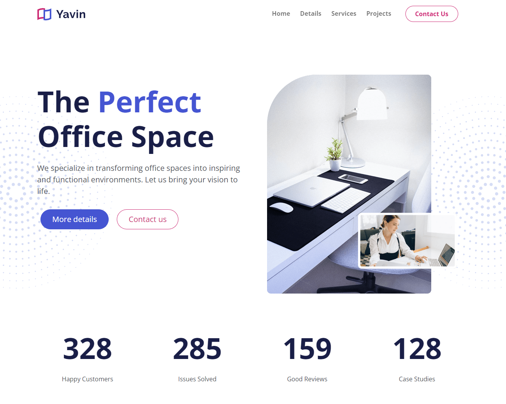

# Yavin Office Design

A modern Bootstrap 5 website for an office space design company, featuring a clean, responsive design with custom styling and interactive elements.



## Project Overview
This repository contains a complete Bootstrap 5 website for Yavin Office Design, showcasing office space design services with a professional, modern aesthetic.

## Features
- Responsive design optimized for all device sizes
- Custom Sass styling with modular architecture
- Interactive navigation with scroll effects
- Animated statistics counter
- Project gallery with filter functionality
- Testimonial carousel
- Contact form with validation
- Inner article page template
- Font Awesome icon integration
- Smooth scrolling and animations
- Cross-browser compatibility

## Getting Started

### Prerequisites
- Node.js (v14.0.0 or later)
- npm (v6.0.0 or later)

### Installation
1. Clone the repository
```bash
git clone https://github.com/yourusername/yavin-office-design.git
cd yavin-office-design
```

2. Install dependencies
```bash
npm install
```

3. Build CSS from Sass
```bash
npm run sass:build
```

4. Run development server with Sass watch
```bash
npm run sass:watch
```

## Project Structure
- `index.html` - Main landing page
- `article.html` - Sample inner page
- `scss/` - Sass source files
  - `bootstrap.scss` - Bootstrap variable overrides
  - `font-awesome.scss` - Font Awesome configuration
  - `styles.scss` - Custom styles
- `css/` - Compiled CSS output (not tracked in Git)
- `js/` - JavaScript files
  - `bootstrap.bundle.min.js` - Bootstrap JS with Popper
  - `script.js` - Custom JavaScript
- `images/` - Image assets
- `webfonts/` - Font Awesome web fonts

## Customization
- Modify Bootstrap variables in `scss/bootstrap.scss`
- Add custom styles in `scss/styles.scss`
- Update content in HTML files
- Replace images in `images/` directory
- Modify JavaScript behavior in `js/script.js`

## Deployment
1. Ensure all changes are committed
2. Push to your GitHub repository
3. Deploy to your preferred hosting service (Netlify, Vercel, GitHub Pages, etc.)

## License
This project is licensed under the MIT License - see the LICENSE file for details.

## Acknowledgments
- [Bootstrap](https://getbootstrap.com/)
- [Sass](https://sass-lang.com/)
- [Font Awesome](https://fontawesome.com/)
